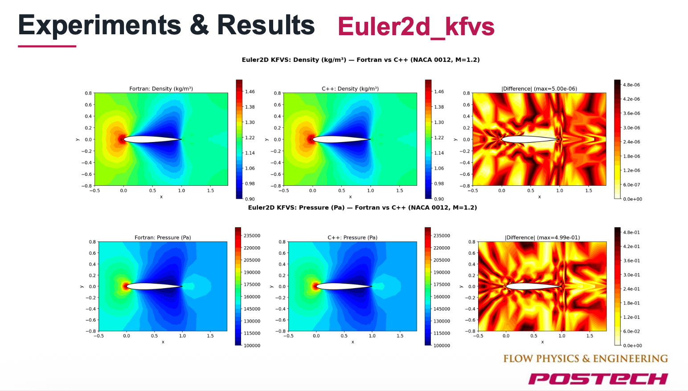
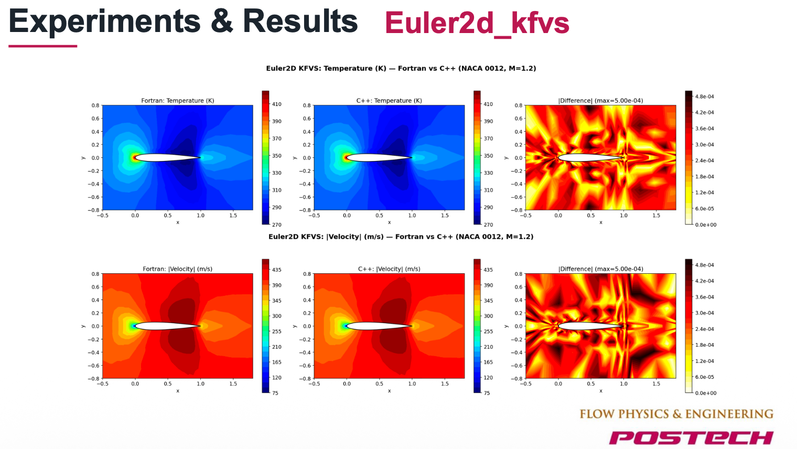
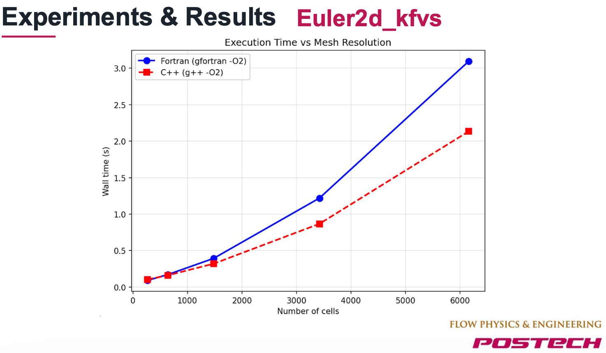
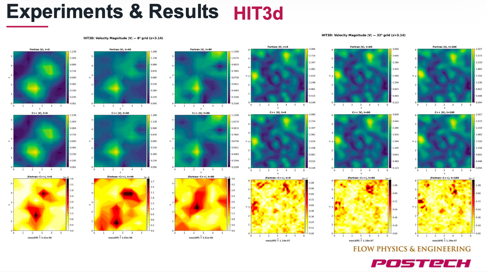
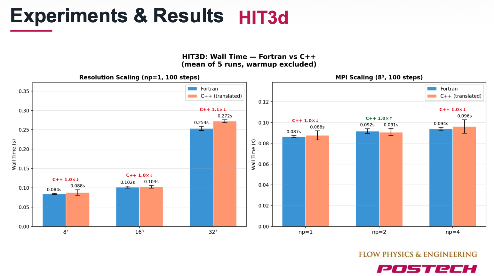
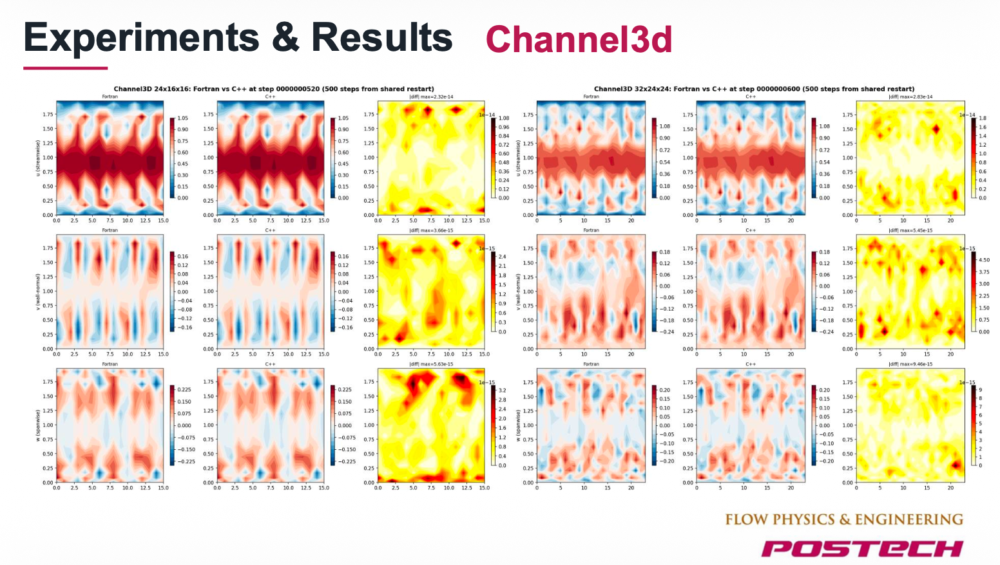
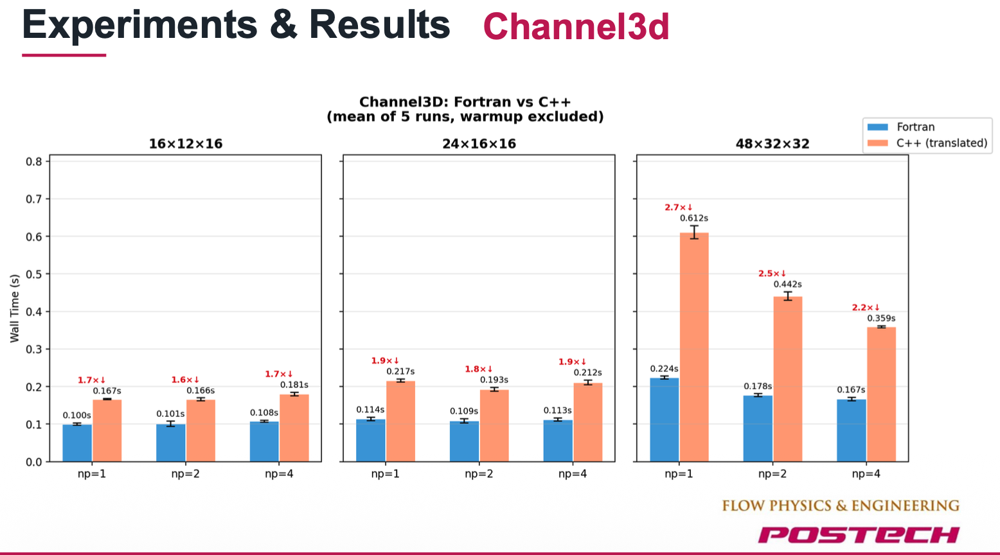

# F2CPP: Automated Fortran-to-C++ Migration System

An AI-powered system that **automatically migrates entire Fortran scientific computing projects to C++** — including compilation, linking, execution, and numerical validation.

> Fully automated. No manual rewriting. Production-validated on real-world CFD codebases.

---

## What It Does

- Takes a Fortran project as input (source code, build system, test data)
- Produces a complete, compilable C++ project as output
- Automatically validates numerical correctness against the original Fortran
- Supports MPI-parallel codebases

## Capabilities

- **Whole-project migration** — handles multi-module Fortran projects with complex dependency graphs
- **Automatic error recovery** — detects and fixes compilation errors iteratively
- **Numerical validation** — compares Fortran vs C++ output with configurable tolerances
- **MPI support** — translates and validates MPI-parallel code with multi-process execution
- **Multi-LLM backend** — compatible with Claude, GPT, DeepSeek, Gemini, and other providers
- **Interactive CLI** — conversational interface for configuring migration tasks

---

## Validated Benchmarks

The system has been tested on real-world CFD (Computational Fluid Dynamics) Fortran projects. All results below are **fully automated** — zero manual intervention.

### Euler2D KFVS — Compressible Flow (NACA 0012 Airfoil)

Density and pressure field comparison (Fortran vs C++). Max difference ~5e-6:

Temperature and velocity fields. Max difference ~5e-4:

C++ outperforms Fortran at higher mesh resolutions:

### HIT3D — Homogeneous Isotropic Turbulence (3D, MPI)

Velocity magnitude at 8³ and 32³ grids:

Near-identical wall time (1.0-1.1x) across resolutions and MPI configurations:

### Channel3D — Turbulent Channel Flow (3D, MPI)

Flow field comparison with machine-precision level agreement:

MPI scaling benchmarks (np=1, 2, 4):

### Results Summary

| Benchmark | MPI | Max Numerical Difference | C++ vs Fortran Speed |
|-----------|-----|--------------------------|---------------------|
| Euler2D KFVS | No | ~5e-6 | **1.0-1.5x faster** |
| HIT3D | Yes | ~1e-7 | **1.0-1.1x** |
| Channel3D | Yes | ~1e-14 | **1.6-2.7x** |

---

## Example Output

The `examples/` directory contains auto-generated C++ code from two benchmark projects:

- **`euler2d_kfvs/`** — 2D Euler compressible flow solver (12 modules, ~26 C++ files)
- **`euler_shock_tube/`** — 1D Euler shock tube solver (6 modules)
- **`runtime/`** — Fortran-compatible C++ runtime headers (array, I/O, namelist)

These are the raw outputs of the system — no manual editing applied.

---

## Contact

For licensing, collaboration, or technical inquiries, please open an issue or reach out directly.

## License

Proprietary. All rights reserved. Source code is not included in this repository.
